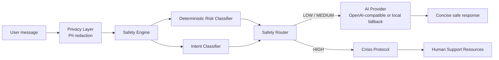

# FirstStep

FirstStep is a hackathon MVP for the Tech Vision 2026 Social & Human Capital track. It gives university students an anonymous, calm place to describe what is happening and identify one safe next step.

## One user — one pain

**User:** a 17–21-year-old university student, especially someone in their first year or newly moved to a different city.

**Pain:** “I feel bad and need support, but I do not know whether it is serious enough to ask for help, and I am afraid or embarrassed to talk to someone.”

FirstStep is not an AI psychologist, therapist, diagnostic system, or replacement for a licensed professional.

## Why AI is necessary

AI helps a student express a messy situation in their own words, preserve the language they use, identify the most relevant intent, and offer one concise, non-clinical next step. The important product decision is that safety routing happens before generative AI.

## Safety-first architecture



Full conversations are not persisted by the MVP. The deterministic classifier is authoritative for high-risk patterns, so an optional model response cannot downgrade a HIGH result.

## Tech stack

- Next.js App Router, React 19, TypeScript
- Plain CSS with a mobile-first responsive design
- OpenAI-compatible provider abstraction with deterministic local fallback
- Local anonymous session ID; no account, phone, email, university, or geolocation
- Config-driven support resources in `src/config/supportResources.ts`

## Local setup

Requires Node.js 20+ and pnpm (or adapt the commands for npm).

```bash
pnpm install --ignore-scripts
Copy-Item .env.example .env.local
pnpm dev
```

Open `http://localhost:3000`.

If PowerShell says that `pnpm` is not recognized, use the system `npm` command instead:

```powershell
npm.cmd run dev
```

Or call the bundled pnpm directly:

```powershell
& "C:\Users\azama\.cache\codex-runtimes\codex-primary-runtime\dependencies\bin\fallback\pnpm.cmd" dev
```

## Environment variables

```env
AI_API_KEY=
AI_BASE_URL=https://api.openai.com/v1
AI_MODEL=gpt-4o-mini
AI_TIMEOUT_MS=15000

# Recommended free/demo provider: Hugging Face Inference Providers.
HF_TOKEN=
HF_BASE_URL=https://router.huggingface.co/v1
HF_MODEL=Qwen/Qwen3-8B
HF_FALLBACK_MODEL=Qwen/Qwen3-4B-Instruct-2507
HF_TIMEOUT_MS=12000
HF_MAX_TOKENS=240
```

If `HF_TOKEN` is configured, low/medium-risk messages use Hugging Face's OpenAI-compatible `/chat/completions` router with Qwen3-8B and Qwen3-4B-Instruct-2507 fallback. If `HF_TOKEN` is empty, the legacy `AI_API_KEY` provider is used; if both are empty, the deterministic local scenarios are selected immediately. The latest six scrubbed turns are included as context. Provider errors fall back to local scenarios. HIGH-risk messages never call a generative provider.

The Hugging Face free allowance is intended for experimentation and is limited; track usage before a public pilot. Keep `HF_TOKEN` server-side in `.env.local` and never expose it through `NEXT_PUBLIC_` variables.

## Deployment

Deploy as a standard Next.js application on Vercel, Render, Railway, or any Node.js host. Set the AI variables in the host's server-side environment settings; do not expose `AI_API_KEY` as a `NEXT_PUBLIC_` variable. The base chat flow does not require a database.

## Limitations and disclaimer

- Keyword rules are an MVP safety layer, not a clinically validated risk assessment.
- Basic PII protection covers obvious phone and email patterns; it is not perfect anonymization.
- Crisis contacts are intentionally not invented. Replace the clearly marked development placeholders in `src/config/supportResources.ts` with verified official Kazakhstan resources before public deployment.
- The app does not diagnose, prescribe, assess clinical severity, or replace human support.

## Roadmap

1. Verify and maintain official Kazakhstan support resources with an independent configuration workflow.
2. Add consent-based aggregate analytics storage without retaining message content.
3. Add human-reviewed evaluation sets for Russian and Kazakh safety routing.
4. Add a bounded classifier provider that can only increase risk, never lower the deterministic result.
5. Conduct accessibility, privacy, and safety review before any real-user pilot.
