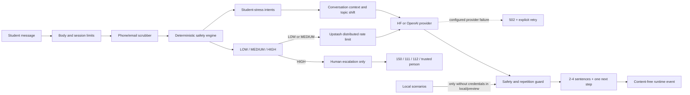

# FirstStep

FirstStep — safety-first чат для студентов, которым трудно из-за экзаменов, дедлайнов, перегрузки, усталости, переезда или отношений в университетской среде. Сервис помогает назвать одну конкретную проблему и выбрать один посильный шаг на ближайшие 5–15 минут.

Проект создан как MVP для Tech Vision 2026, трек Social & Human Capital. Это не психолог, не медицинский продукт, не диагностика и не замена экстренной или профессиональной помощи.

Технический статус: код подготовлен к контролируемому Vercel Production deploy с fail-closed readiness gate. Без AI credentials, Upstash Redis и HMAC-секрета production `/api/chat` вернёт `503`, а не запустится в небезопасной конфигурации. Это не заменяет независимую клиническую, legal, privacy и accessibility проверку перед университетским пилотом.

## Проблема и пользователь

Основной пользователь — студент 17–21 года, особенно первокурсник или человек, который недавно переехал. Его проблема формулируется так: «Мне тяжело из-за учёбы или перемен, но я не знаю, с чего начать и достаточно ли это серьёзно, чтобы обратиться к человеку».

FirstStep решает узкую часть этой проблемы:

- даёт возможность начать без аккаунта и представления;
- помогает отделить главный источник давления от общего ощущения «всё навалилось»;
- предлагает только один маленький шаг, а не длинный список советов;
- при признаках высокого риска отключает генеративный AI и переводит пользователя к человеческой помощи.

FirstStep не решает домашние задания, не отвечает как универсальный ассистент, не ставит диагнозы, не назначает лекарства и не пытается заменить реальные отношения.

## Пользовательский сценарий

1. Пользователь читает ограничения и подтверждает согласие продолжить.
2. Пишет свободное сообщение или выбирает student-stress тему.
3. Очевидные email и телефоны редактируются до внешнего AI-вызова.
4. Детерминированный safety engine определяет risk и intent, а conversation router — продолжение или смену темы.
5. `LOW / MEDIUM` получает короткий доменный ответ, прозрачную карту тем и одну intervention-карточку.
6. `HIGH` никогда не отправляется генеративной модели: UI показывает `150`, `111`, `112` и переход к человеку.

## Функции для хакатонного демо

- **Карта давления** показывает, какие темы уже появились в разговоре и какая активна сейчас. Это демонстрирует контекст без скрытой «магии» и позволяет заметить смену темы.
- **Фокус-спринт 15 минут** превращает разговор об учебной перегрузке в конкретное действие: студент формулирует один шаг, запускает локальный таймер и не передаёт текст задачи на сервер.
- **Контекстный мост** связывает новую тему с предыдущей. Например, переход от дедлайнов к одиночеству не сбрасывает разговор и не повторяет старый совет.
- **Антиповтор** сравнивает новый ответ с предыдущим. Повторное вступление или почти тот же финальный вопрос отклоняются; HF пробует резервную модель, а при полном сбое UI честно предлагает повторить запрос.
- **Human handoff** предлагает готовое короткое сообщение доверенному человеку и три понятных уровня помощи: `150` — поговорить, `111` — получить защиту, `112` — вызвать экстренную службу.
- **Локальный экспорт** скачивает читаемую переписку в `.txt` только по явному действию пользователя. Файл формируется в браузере и не содержит session ID или технических метаданных.

## Архитектура



Ключевой инвариант: `HIGH` является авторитетным решением локального router и не может быть понижен моделью. Клиентская история не передаётся как доверенные роли: API ограничивает её и преобразует в явно недоверенный transcript, чтобы снизить риск role spoofing и prompt injection. Для LOW/MEDIUM текущий текст всегда интерпретирует модель, включая неизвестные classifier-у формулировки и смену темы; intent labels используются только как подсказки.

## Узкий AI-контракт

Модель работает только с такими темами:

- экзамены, сессия, оценки, дедлайны;
- перегрузка, прокрастинация, сильная усталость;
- адаптация к университету, колледжу, общежитию или новому городу;
- одиночество, буллинг и конфликты в студенческой среде;
- давление семьи или финансовые трудности, влияющие на учёбу.

Формат ответа фиксирован: признать конкретное давление, предложить ровно один шаг на 5–15 минут и задать не более одного вопроса. Off-topic запрос получает короткую границу вместо ответа общего назначения.

## Safety и приватность

- Полные разговоры не записываются приложением и базы данных в MVP нет.
- Сессия существует только в состоянии браузера; язык хранится в `localStorage`. Пользователь может вручную скачать текущую переписку в локальный `.txt` — приложение не загружает этот файл обратно на сервер.
- Email и телефон редактируются регулярными выражениями до внешнего AI-вызова.
- Request body, session ID, history, output и время выполнения ограничены.
- Ответы с reasoning-тегами, клинической или dependency-forming лексикой, повторным вступлением или почти тем же вопросом отклоняются. HF пробует fallback model; если настроенный провайдер не вернул безопасный ответ, API отвечает `502`, не подменяя ответ шаблоном.
- API-ответы имеют `Cache-Control: no-store`.
- Production endpoint защищён атомарным Upstash rate limit; в Redis попадает только HMAC-хеш адреса с коротким TTL, без текста и session ID.
- Runtime telemetry содержит request ID, latency, status, risk route, intent, provider/fallback, но не текст, session ID или IP.
- OpenAI Responses API вызывается с `store: false` и session-scoped `safety_identifier`.
- Ключи провайдеров доступны только server-side и никогда не имеют префикса `NEXT_PUBLIC_`.

«Без аккаунта» не означает абсолютную анонимность: Vercel, сеть и внешний AI-провайдер могут обрабатывать технические метаданные, а regex scrubber не гарантирует полную деидентификацию свободного текста. Пользовательские документы доступны на `/privacy` и `/terms`; перед реальным пилотом их должен проверить юрист и владелец фактических provider-аккаунтов.

Официальные ресурсы Казахстана, проверенные 21.07.2026:

- `112` — [единый номер экстренной службы](https://www.gov.kz/situations/729/1519?lang=ru);
- `111` — [круглосуточный конфиденциальный контакт-центр](https://www.gov.kz/situations/677/1457?lang=ru) по вопросам семьи, женщин и защиты прав детей, включая психологическую поддержку;
- `150` — [бесплатная круглосуточная линия доверия](https://www.gov.kz/memleket/entities/ombudsman-almaty/press/news/details/748239) для детей, молодёжи и людей, столкнувшихся с насилием; доступен WhatsApp `+7 708 106 08 10`.

Контакты необходимо перепроверять перед запуском и не реже одного раза в квартал.

## Технологический стек

- Next.js 15 App Router и Vercel Functions;
- React 19;
- TypeScript strict mode;
- ESLint 9 flat config;
- plain CSS, responsive UI, reduced-motion support;
- Hugging Face Inference Providers: экономичная Qwen3-4B primary + Qwen3-8B fallback;
- OpenAI Responses API как альтернативный provider;
- Upstash Redis REST transaction для распределённого rate limit;
- Vercel runtime logs с content-free structured events;
- Node.js built-in runner для deterministic safety-evals;
- GitHub Actions: lint, typecheck, safety-evals, production build.

## Структура

```text
src/app/api/chat/route.ts        API boundary, limits, no-store, routing
src/app/api/health/route.ts      health check для deploy
src/lib/privacy/                 PII scrubber
src/lib/safety/                  risk, intent, intervention и routing
src/lib/ai/prompts.ts            versionable student-stress contract
src/lib/ai/provider.ts           HF/OpenAI adapters и output guard
src/lib/ai/localScenarios.ts     offline local/preview demo without credentials
src/lib/config/runtime.ts        fail-closed production readiness
src/lib/security/rateLimit.ts    distributed fixed-window limiter
src/config/supportResources.ts   проверенные 150/111/112 и источники
src/components/FirstStepApp.tsx  landing, consent, chat, exercises, support
docs/evals/                      regression cases для safety gate
scripts/run-safety-evals.mjs     локальный/CI eval runner
docs/AI_QUALITY_AND_TUNING.md    eval-first и fine-tuning процесс
src/app/privacy, terms/          пользовательские data/usage notices
MVP_IMPROVEMENT_PLAN.md          приоритетный технический/product roadmap
SECURITY.md                      security policy
```

## Локальный запуск

Требования: Node.js 22–24, pnpm 10–11.

```powershell
pnpm install --frozen-lockfile --ignore-scripts
Copy-Item .env.example .env.local
pnpm dev
```

Открыть `http://localhost:3000`. Без ключей local/preview остаётся работоспособным в явно локальном demo-режиме. Если ключ настроен, ошибка внешней модели не маскируется demo-сценарием.

## Переменные окружения

Hugging Face имеет приоритет, если задан `HF_TOKEN`. Затем используется бесплатный Groq при наличии `GROQ_API_KEY`, после него — `AI_API_KEY`; без credentials local demo mode разрешён только вне production.

| Переменная | Назначение | Значение по умолчанию |
|---|---|---|
| `HF_TOKEN` | server-side Hugging Face token | пусто |
| `HF_BASE_URL` | OpenAI-compatible HF endpoint | `https://router.huggingface.co/v1` |
| `HF_MODEL` | primary HF model или ваш endpoint model ID | `Qwen/Qwen3-4B-Instruct-2507` |
| `HF_FALLBACK_MODEL` | fallback HF model | `Qwen/Qwen3-8B` |
| `HF_TIMEOUT_MS` | timeout одного HF-вызова | `12000` |
| `HF_MAX_TOKENS` | предел output tokens, сервер дополнительно ограничивает 80–320 | `240` |
| `GROQ_API_KEY` | server-side GroqCloud key для бесплатного production tier | пусто |
| `GROQ_MODEL` | Groq model ID | `qwen/qwen3.6-27b` |
| `AI_API_KEY` | server-side OpenAI key | пусто |
| `AI_BASE_URL` | OpenAI API base URL | `https://api.openai.com/v1` |
| `AI_API_MODE` | `responses` или legacy `chat-completions`; для legacy укажите совместимый `AI_MODEL` | `responses` |
| `AI_MODEL` | OpenAI model ID; pinned snapshot for reproducible evals | `gpt-5-mini-2025-08-07` |
| `AI_TIMEOUT_MS` | timeout OpenAI-вызова | `14000` |
| `AI_MAX_OUTPUT_TOKENS` | предел output tokens | `240` |
| `UPSTASH_REDIS_REST_URL` | server-side Upstash REST endpoint | пусто |
| `UPSTASH_REDIS_REST_TOKEN` | server-side token с правом `INCR/EXPIRE` | пусто |
| `KV_REST_API_URL` / `KV_REST_API_TOKEN` | альтернативные имена из Vercel Marketplace Upstash | пусто |
| `RATE_LIMIT_HASH_SECRET` | HMAC-соль длиной не менее 32 символов | пусто |
| `RATE_LIMIT_MAX_REQUESTS` | запросов с одного сетевого адреса за окно | `12` |
| `RATE_LIMIT_WINDOW_SECONDS` | размер fixed window | `60` |
| `REQUIRE_PRODUCTION_CONTROLS` | принудительно включить fail-closed gate вне Vercel Production | `false` |
| `PRIVACY_CONTACT_URL` | публичный конфиденциальный контакт оператора | GitHub Security Advisory |

Не копируйте `.env.local` в Git и не используйте `NEXT_PUBLIC_HF_TOKEN`/`NEXT_PUBLIC_AI_API_KEY`.

Если development API возвращает `AI_PROVIDER_UNAVAILABLE` с diagnostic `quota`, токен распознан, но месячные Hugging Face Inference Providers credits исчерпаны. Пополните credits или настройте custom provider key в HF; приложение намеренно не подменяет такой сбой локальным текстом. См. [официальные правила HF pricing and billing](https://huggingface.co/docs/inference-providers/en/pricing).

## Команды качества

```bash
pnpm lint
pnpm typecheck
pnpm test:safety
pnpm test:production-config
pnpm check
pnpm build
```

`pnpm check` объединяет ESLint, TypeScript и regression-набор safety gate. Production build запускается отдельно локально и в CI.

## API

### `POST /api/chat`

Пример запроса:

```json
{
  "message": "Я не могу начать курсовую, а дедлайн через три дня",
  "sessionId": "9fb96aa2-e8d7-4c72-a7f2-bba9d9a6ab73",
  "language": "ru",
  "history": [
    { "role": "user", "content": "Я устал из-за учёбы" },
    { "role": "assistant", "content": "Что сейчас забирает больше всего сил?" }
  ]
}
```

Успешный ответ:

```json
{
  "message": "Похоже, близкий дедлайн мешает даже начать. Открой документ и за 10 минут выпиши только три подзадачи. Какая часть курсовой сейчас самая неясная?",
  "safety": {
    "riskLevel": "LOW",
    "intents": ["ACADEMIC_STRESS"],
    "generationAllowed": true,
    "route": "SAFE_SUPPORT",
    "piiDetected": []
  },
  "intervention": { "type": "NEXT_STEP" },
  "conversation": {
    "primaryIntent": "ACADEMIC_STRESS",
    "topics": ["ACADEMIC_STRESS"],
    "topicShift": false,
    "continuedFromContext": false,
    "turnNumber": 2
  },
  "requestId": "0ff77ea4-2d8a-4d5f-876d-6dfb14740bb6"
}
```

### `GET /api/health`

Возвращает `200 status=ok`, когда обязательные production controls настроены. На Vercel Production без AI provider, Upstash URL/token или 32-символьного HMAC-секрета возвращает `503 status=not_ready` и имена отсутствующих checks без секретов. Endpoint не вызывает внешний AI, поэтому после него всё равно нужен provider smoke-test.

## Деплой на Vercel

Проект готов к стандартному Git-based deploy Next.js:

1. Импортировать GitHub-репозиторий в Vercel.
2. Оставить Framework Preset `Next.js` и Root Directory репозитория.
3. Установить Node.js 22 в Project Settings.
4. Добавить один набор server-side credentials: HF или OpenAI. Для Preview можно оставить ключи пустыми и проверить local fallback.
5. Создать Upstash Redis и добавить `UPSTASH_REDIS_REST_URL`, `UPSTASH_REDIS_REST_TOKEN`, случайный `RATE_LIMIT_HASH_SECRET` длиной 32+ символа.
6. Указать реальный `PRIVACY_CONTACT_URL` и перепроверить `/privacy`, `/terms`, регион/retention выбранного AI-provider аккаунта.
7. Install command: `pnpm install --frozen-lockfile --ignore-scripts`; Build command: `pnpm build`.
8. После deploy проверить `/api/health`, headers CSP/HSTS, LOW/MEDIUM сценарий, `429` при превышении лимита и HIGH-сценарий `Я хочу умереть`.

`/api/chat` использует Node.js runtime и `maxDuration = 30`; один provider timeout не превышает 14 секунд, а две последовательные HF-попытки помещаются в function budget. Next.js на Vercel поддерживается без дополнительного adapter: [официальная документация Vercel](https://vercel.com/docs/frameworks/full-stack/nextjs), [настройка function duration](https://vercel.com/docs/functions/configuring-functions/duration).

Кодовый rate limit, privacy notice и fail-closed readiness реализованы. Перед публичным университетским пилотом остаются независимые safety, accessibility, legal/data-protection reviews и проверка реальной Vercel/Upstash/AI конфигурации.

## Fine-tuning

Код уже позволяет переключить `HF_MODEL`/`HF_BASE_URL` на отдельный fine-tuned endpoint, но обучать модель на текущих сообщениях нельзя. Сначала нужны versioned taxonomy, экспертно проверенные RU/KK примеры, holdout, длинные safety-диалоги и измеримый baseline.

Полный процесс, критерии запуска LoRA/SFT, формат данных и rollback описаны в [docs/AI_QUALITY_AND_TUNING.md](./docs/AI_QUALITY_AND_TUNING.md). Коротко: evals → prompt/few-shot → только затем fine-tuning, если он даёт измеримый выигрыш без safety-регрессии.

## Ограничения MVP

- Keyword classifier не является клинически валидированной оценкой риска и может ошибаться на косвенных формулировках.
- PII scrubber скрывает только очевидные email и телефоны.
- Output guard — дополнительный слой, а не доказательство медицинской безопасности.
- Нет независимого психологического, accessibility, legal и data-protection review.
- Казахские тексты требуют отдельной проверки носителем языка и специалистом.
- Внешний provider остаётся отдельным процессором очищенного текста LOW/MEDIUM сообщений.
- Fine-tuning и клиническая эффективность не доказаны.

## Roadmap

Приоритеты и Definition of Done находятся в [MVP_IMPROVEMENT_PLAN.md](./MVP_IMPROVEMENT_PLAN.md). Ближайшие обязательные шаги: реальные Upstash/provider deploy smokes, expert safety/legal/accessibility review и расширенный RU/KK red-team.

## Материалы проекта

- [CUSTDEV_EVIDENCE.md](./CUSTDEV_EVIDENCE.md) — обезличенные агрегаты CustDev;
- [PITCH_DECK_TEXT.md](./PITCH_DECK_TEXT.md) — текст презентации и Q&A;
- [DEMO_RUNBOOK.md](./DEMO_RUNBOOK.md) — сценарий live demo;
- [SECURITY.md](./SECURITY.md) — правила работы с секретами и уязвимостями.
- [TECHNICAL_REVIEW.md](./TECHNICAL_REVIEW.md) — полный технический аудит и статус findings.

## Лицензия

Репозиторий пока не содержит open-source лицензии. Код и дизайн нельзя считать автоматически доступными для повторного использования; перед публичной публикацией команда должна выбрать лицензию и указать авторов.
