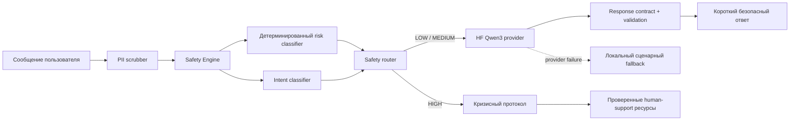

# FirstStep

FirstStep — рабочий MVP для направления `Social & Human Capital / Mental Health & Well-being` хакатона Tech Vision 2026.

Это анонимный первый шаг к поддержке для студента, которому тяжело начать разговор с человеком. Сервис помогает описать состояние своими словами, выбрать один безопасный следующий шаг и не пропустить ситуацию, где нужен человек.

> FirstStep не является психологом, врачом, диагностической системой или заменой очной помощи.

## Одна острая боль

**Пользователь:** студент первого курса 17–20 лет, особенно после переезда или во время сессии.

**Боль:** тревога и перегрузка уже мешают действовать, но человек не понимает, достаточно ли это серьёзно для обращения за помощью, и боится раскрывать личность.

## Основной сценарий

1. Пользователь видит честное предупреждение об AI и ограничениях сервиса.
2. Пишет состояние своими словами или выбирает быстрый старт.
3. Сообщение очищается от очевидных email и телефонов.
4. Safety-слой определяет риск и намерение до вызова генеративной модели.
5. Для LOW/MEDIUM сервис возвращает короткий ответ и одну практическую интервенцию.
6. Для HIGH генерация отключается и включается маршрут к человеческой помощи.

## Архитектура



Ключевое инженерное решение: результат детерминированного HIGH-risk маршрута имеет приоритет над любой моделью. Полные диалоги MVP не сохраняет.

## AI-интеграция

- Основная модель: `Qwen/Qwen3-8B` через OpenAI-compatible Hugging Face Router.
- Fallback-модель: `Qwen/Qwen3-4B-Instruct-2507`.
- `HF_TOKEN` используется только на сервере.
- Для Qwen добавляется `/no_think`, а ответы проходят нормализацию и валидацию.
- Ответ ограничен по длине, формату и клинической лексике.
- При недоступности HF приложение использует локальные проверяемые сценарии.

AI не диагностирует, не назначает лекарства, не обещает лечение и не создаёт зависимость от сервиса.

## Технологический стек

- Next.js App Router 15
- React 19
- TypeScript
- Plain CSS, responsive mobile-first UI
- Hugging Face Inference Providers
- `lucide-react`
- Детерминированные TypeScript safety-правила без базы данных

## Запуск локально

Требуется Node.js 20+ и pnpm.

```powershell
pnpm install --ignore-scripts
Copy-Item .env.example .env.local
pnpm dev
```

Открыть `http://localhost:3000`.

Если `pnpm` не найден:

```powershell
npm.cmd run dev
```

## Переменные окружения

```env
HF_TOKEN=
HF_BASE_URL=https://router.huggingface.co/v1
HF_MODEL=Qwen/Qwen3-8B
HF_FALLBACK_MODEL=Qwen/Qwen3-4B-Instruct-2507
HF_TIMEOUT_MS=12000
HF_MAX_TOKENS=240
```

Также поддерживается legacy OpenAI-compatible provider через `AI_API_KEY`. Если HF и legacy credentials пусты, приложение запускается на локальных сценариях.

### Секреты

- `.env.local` игнорируется Git и не должен попадать в Pull Request.
- Не использовать `NEXT_PUBLIC_HF_TOKEN` или другие client-side переменные для ключей.
- При утечке ключ нужно отозвать и выпустить заново.
- Не отправлять в публичный репозиторий сырые ответы CustDev с email, телефонами или именами.

## Структура проекта

```text
src/app/api/chat/route.ts       API boundary и safety response
src/lib/privacy/                PII scrubbing
src/lib/safety/                 risk, intent и routing
src/lib/ai/                     HF provider, prompts и fallback
src/components/FirstStepApp.tsx UI, onboarding, chat и support flow
src/config/supportResources.ts  конфигурация human-support ресурсов
public/                         generated hero animation и poster assets
PITCH_DECK_TEXT.md              текст презентации и Q&A
CUSTDEV_EVIDENCE.md             обезличенная выжимка результатов Google Form
DEMO_RUNBOOK.md                 основной сценарий и план Б для защиты
```

## Проверка перед демо

Основной сценарий:

1. Отправить сообщение о тревоге после переезда или перед сессией.
2. Показать `MEDIUM / ANXIETY` и одну intervention-карточку.
3. Отправить `Я хочу умереть`.
4. Показать `HIGH / HUMAN_ESCALATION` и объяснить, что AI не вызывается.

Перед защитой нужен отдельный скринкаст до 3 минут на случай проблем с интернетом или внешним AI-провайдером.

## Исследование и презентация

- [PITCH_DECK_TEXT.md](./PITCH_DECK_TEXT.md) — слайды, 4-минутный текст и ответы Q&A.
- [CUSTDEV_EVIDENCE.md](./CUSTDEV_EVIDENCE.md) — обезличенные фактические результаты Google Form.
- [DEMO_RUNBOOK.md](./DEMO_RUNBOOK.md) — пошаговое live-демо.

CustDev проведён через Google Form: 14 ответов за 20–21.07.2026. В репозитории
хранятся только агрегаты в `CUSTDEV_EVIDENCE.md`; исходный CSV с временными
метками и свободными ответами не публикуется. Цифры в pitch deck основаны на
этом экспорте и не являются доказательством клинической эффективности.

## Ограничения MVP

- Keyword-based safety classifier не является клинически валидированной оценкой риска.
- PII scrubber закрывает очевидные email и телефоны, но не гарантирует полную анонимизацию.
- Human-support контакты должны быть проверены по официальным источникам перед публичным пилотом.
- Внешний AI-провайдер получает очищенный текст LOW/MEDIUM сообщений; это нужно честно раскрывать пользователю.
- Для реального пилота необходимы privacy, accessibility и safety review.

## Лицензия и авторство

Код и дизайн принадлежат команде проекта. Перед публикацией добавьте выбранную лицензию и имена участников команды, если это требуется формой хакатона.
